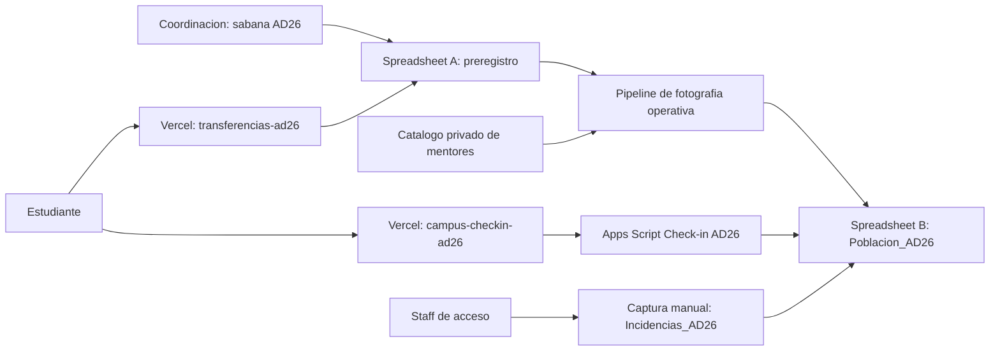

# Arquitectura integrada de Transferencias AD26

Este documento distingue e integra los dos instrumentos digitales de la estrategia de acompanamiento a estudiantes de transferencia para Agosto-Diciembre 2026. Aunque ambos usan una rama llamada `ad26`, viven en repositorios, proyectos Vercel, Apps Script y Google Sheets distintos.

## 1. Preregistro e invitacion

| Componente | Valor |
| --- | --- |
| Proposito | Invitar, consultar asignacion y registrar respuesta `SI/NO` antes del evento |
| Repositorio | `MentorIATec/nodoxtransferencias` |
| Ruta local | `/Users/karenguzman/nodoxtransferencias` |
| Rama | `ad26` |
| Frontend Vercel | `https://transferencias-ad26.vercel.app` |
| Spreadsheet A | `A | Pre-registro Transferencias Campus Monterrey | AD26` |
| Spreadsheet ID | `1jHE0OAX7EXTyo5Try8Jh5J_xwP0g_PEztxxiQBuGwZU` |
| Apps Script | Web App AD26 del repositorio `nodoxtransferencias` |
| Regla de cupo | Maximo de 400 respuestas `SI` unicas |

El preregistro contiene la poblacion invitada, las asignaciones de mentor/comunidad, la respuesta previa y la comunicacion por correo. El limite de 400 aplica solamente en esta etapa.

## 2. Check-in presencial

| Componente | Valor |
| --- | --- |
| Proposito | Registrar la llegada fisica al evento y consolidar capturas manuales |
| Repositorio | `MentorIATec/campus-checkin` |
| Ruta local | `/Users/karenguzman/campus-checkin` |
| Rama | `ad26` |
| Proyecto Vercel sugerido | `campus-checkin-ad26` |
| Spreadsheet B | `B | Campus Check-in AD26` |
| Spreadsheet ID | `1HA6Vz3He1kcPENdnl4IIl1Y-Dc927qb7UQvegXeeqOk` |
| Apps Script | `ad26/apps-script/Code.js` y `ad26/apps-script/Setup.js` |
| Regla de acceso | No se bloquea el ingreso onsite por alcanzar 400 preregistros |

El check-in resuelve los datos del estudiante desde `Poblacion_AD26` y registra una sola entrada digital por `matricula|event_id`. Las transferencias tardias o matriculas fuera del padron se capturan directamente en `Incidencias_AD26`.

## 3. Integracion entre ambos sistemas

La integracion es por fotografia de datos, no por escritura cruzada en tiempo real:

1. La sabana oficial se normaliza en el sistema de preregistro.
2. Antes del evento se genera `Poblacion_AD26` en el Spreadsheet B.
3. La fotografia conserva por matricula: mentor, comunidad, poblacion Salud, preregistro y respuesta `SI/NO`.
4. Durante el evento, el frontend de check-in consulta y escribe exclusivamente en el Spreadsheet B.
5. `Checkins_AD26` permite comparar quienes se preregistraron y asistieron, quienes no se preregistraron y quienes llegaron fuera del padron.

No deben compartirse API keys, deployments de Apps Script ni hojas de respuestas entre periodos. La matricula y el `event_id` son las llaves de vinculacion operativa.

## 4. Escuela de Salud

- En preregistro puede no existir mentor individual.
- En la fotografia de check-in se conserva `tipo_poblacion=SALUD`.
- La UI muestra `Escuela de Salud` y la comunidad `Comunidades Academicas`.
- Salud participa en check-in e indicadores sin forzar una asignacion de mentor.

## 5. Ruta para actualizar imagenes de mentores

1. Copiar cada imagen al directorio local `/Users/karenguzman/campus-checkin/public/mentores/`.
2. Usar en `Mentores_AD26.foto_mentor` solo el nombre exacto del archivo, por ejemplo `KarenKrei.jpg`.
3. La ruta publica se construye como `/mentores/<foto_mentor>`; no guardar URLs absolutas en Sheets.
4. Respetar exactamente mayusculas, espacios, acentos y extension. Vercel distingue nombres que macOS puede tratar como equivalentes.
5. Ejecutar `npm run validate:mentor-assets` desde `/Users/karenguzman/campus-checkin`.
6. Corregir todas las referencias faltantes antes del ensayo integral y confirmar visualmente en telefono.
7. Crear un commit exclusivo para assets cuando se reciba el paquete final; no subir `DATOSME_CURSOR.xlsx` porque contiene datos privados.

## 6. Fronteras operativas

- El preregistro controla invitacion, respuesta y cupo.
- El check-in controla presencia fisica digital y duplicados.
- `Incidencias_AD26` conserva los registros manuales; no existe API ni dashboard independiente para autorizaciones.
- El resumen AD26 vive en el Spreadsheet B y se consulta manualmente; el frontend no hace polling.
- Los cambios FJ26 permanecen como referencia historica y no deben desplegarse sobre los dominios AD26.
- Al terminar el evento se cierran las escrituras, se conserva la evidencia y se archivan ambos deployments AD26 por separado.

## 7. Secuencia de liberacion

1. Validar la sabana y las asignaciones en preregistro.
2. Congelar y transferir la fotografia a `Poblacion_AD26`.
3. Validar imagenes y poblacion Salud.
4. Probar lookup, check-in, duplicado y captura manual en Sheets.
5. Ejecutar prueba concurrente con 20 a 30 dispositivos.
6. Publicar los dos proyectos Vercel con dominios distintos.
7. Mantener QR separados: preregistro antes del evento y check-in exclusivamente durante el acceso.
